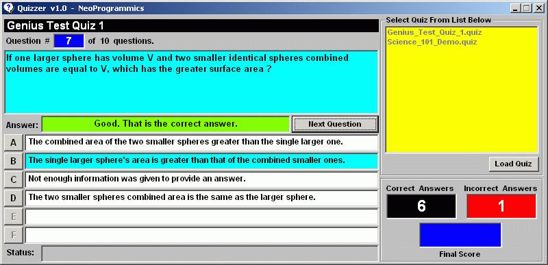



## Quizzer v1\.0

### Description

This program will generate a quiz for the user.

Quiz data files can be written using a plain text editor such as NotePad and can be on any subject and can have as many questions as desired.

Each quiz question can have from 2 to 6 possible multiple choice answers for the user to guess.

Two example quiz files are provided with the source code to demonstrate the program and the format of the quiz data files.

The program is relatively simple and can easily be expanded upon.
 
### More Info
 

             |
---                |---
**Submitted On**   |2001-07-03 03:28:52
**By**             |[Jay Tanner](https://github.com/Planet-Source-Code/PSCIndex/blob/master/ByAuthor/jay-tanner.md)
**Level**          |Intermediate
**User Rating**    |4.9 (44 globes from 9 users)
**Compatibility**  |VB 6\.0
**Category**       |[Games](https://github.com/Planet-Source-Code/PSCIndex/blob/master/ByCategory/games__1-38.md)
**World**          |[Visual Basic](https://github.com/Planet-Source-Code/PSCIndex/blob/master/ByWorld/visual-basic.md)
**Archive File**   |[Quizzer v122121732001\.zip](https://github.com/Planet-Source-Code/jay-tanner-quizzer-v1-0__1-24673/archive/master.zip)

